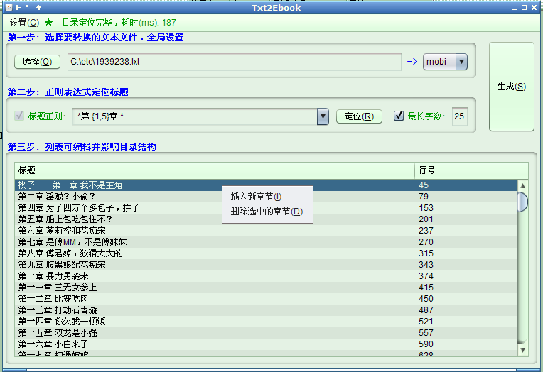

Txt2eBook Java Swing版(文本转电子书:mobi,epub,umd)
-----------------------------------------
**声明:** 本程序调用了 amazon 的 kindlegen/mobigen，code.google上的umdbuilder, 版权归各被调用程序及库的所有者

**名称:** Txt2eBook-Java

**功能:** 将文本文件转换为各种格式的电子书:mobi(Kindel电子书),Epub(不包含字体),umd(手机电子书)

**作者:** 爱尔兰之狐(linpinger)

**邮箱:** [linpinger@gmail.com](mailto:linpinger@gmail.com)

**主页:** <http://linpinger.github.io?s=Atc_Txt2eBook_java>

**缘起:** 不知道为什么写这个java版本，也许觉得要扩展以后在Linux下的用途吧，于是就写了

**亮点:** Java写的程序，可以跨平台使用，当然由于kindlegen只有win/linux/mac三个平台，所以你懂的

**第三方:**
- code.google上的umdbuilder
- amazon 的 kindlegen <https://www.amazon.com/gp/feature.html?ie=UTF8&docId=1000765211>
- iHarder.net的FileDrop.java类 <http://iharder.sourceforge.net/current/java/filedrop/>

**下载:**
- 百度网盘下载 <http://pan.baidu.com/s/1bnqxdjL>
- 源代码: <https://github.com/linpinger/txt2ebook-java.git>

**截图:**
 

**使用方法:**

- 安装[JRE](http://www.java.com/zh_CN/download/index.jsp)或JDK，绿色版也行，反正需要javaw.exe
- 将 kindlegen 放到 系统PATH变量中的文件夹，例如c:\WINDOWS\system32\ 或 /usr/bin/ 之类的，也许 Txt2eBook.jar 文件所在的文件夹也行，试试呗
- 双击Txt2eBook.jar运行程序 或 绿色版java路进/javaw -jar Txt2eBook.jar 或 Linux下 /xxx/ooo/java -jar Txt2eBook.jar
- 如果看到界面，就可以愉快的玩耍了
- 制作电子书第一步，按 选择 按钮 选择要转换的txt文件，然后选择要转换的格式，默认mobi格式
- 按 定位 按钮根据标题正则自动在下面生成章节列表，如果生成错误，可以调整正则表达式和标题最常字数，然后再按 定位按钮
- 如果章节列表文字乱码，在 设置 菜单下面人工指定编码格式，再按 定位 按钮
- 可以双击编辑标题和行号，可以右键添加新章节，或删除多余章节
- 可以在 设置 菜单下面的 其他设置 中设置书名和作者，默认书名就是文件名
- 现在可以按 生成 按钮了
- 电子书 如果存在 /dev/shm/ 文件夹就保存在这里，不然就保存在 txt所在文件夹
- 有其他文本编码要加入的，或者其他功能需要加入的，可以email联系作者(头部有地址)，不能保证迅速回复，只能保证收到消息后尽快回复

**可能的保存生成电子书的路径:**

- /dev/shm/ 如果存在
- 文件所在目录

**2018-01-03日新增:**

- 现在可以一次拖动单个或多个txt到程序界面上，单个就单独处理，多个就批量转换为mobi(自动检测txt编码，转成html，然后再转成mobi)
- 默认窗口置顶，在设置菜单中选中菜单可取消
- 一些库函数，现更换为其他项目使用的公共函数，免得维护困难
- 字体调整为Linux下默认字体，大小为14

**更新日志:**

- 2018-01-10: 同步 FoxEpubWriter.java，修改代码以适应该库的更新
- 2018-01-03: 添加批量txt转mobi功能，Linux下的使用，原拖动功能只在win下有效，现使用第三方库来实现，比较稳定
- 2015-01-30: 修正生成mobi遇到的卡死问题，更新部分主题以及对话框生成方式，还有作者名
- 2014-09-22: 发布第一版，可以生成mobi,epub,txt,umd格式，PDF暂不支持(主要没更新的欲望啊)

